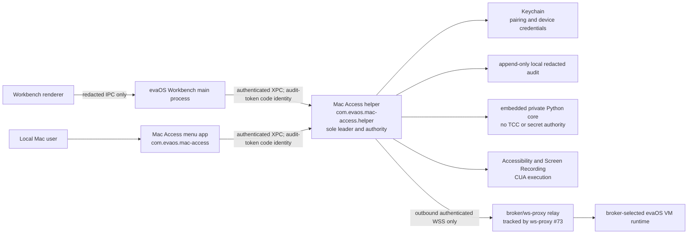

# evaOS Mac Access v0.1 architecture contract

Issue: [#699](https://github.com/100yenadmin/evaOS-GUI/issues/699)
Parent: [#698](https://github.com/100yenadmin/evaOS-GUI/issues/698)
Contract version: `2026-07-15.v2`
Inspected Workbench source: PR #697 final head `fff813ef1da6b766ae09344b20021b4a4b0672c4`, merge `0ac9742cc8c42d777da627adb9cf4179567d1373`; PR #708 final head `5b1308fadc481f83116c54de2b9713ab2363bed2`, merge `5c86e8e91660772da5b1b6f49b43f2de3afee737`; PR [#709](https://github.com/100yenadmin/evaOS-GUI/pull/709) final head `f92d45f984db29c132e65f458df85567f04186ca`, merge `27b28cd234d537a491028e9024070cf8d33b9611`

## Decision

evaOS Mac Access is an independently signed and updated native menu-bar app. Its embedded signed helper is the one local connector leader, policy authority, Keychain custodian, audit writer, and TCC/CUA executor. The menu app and evaOS Workbench are authenticated clients of that helper; neither renderer nor the embedded Python runtime becomes a trust authority.

The Mac opens an outbound authenticated WebSocket to the evaOS broker relay. It accepts work only when every selected customer, VM, Mac device, grant, runtime, binding, connector-key, nonce, sequence, expiry, and request-digest field verifies. There is no direct IP, inbound public port, customer-managed Tailscale, reusable connector URL/token, terminal step, system Python, or Homebrew requirement.

Backend support for that outbound Mac relay does not exist at the inspected ws-proxy head. It is tracked in [electricsheephq/evaos-ws-proxy#73](https://github.com/electricsheephq/evaos-ws-proxy/issues/73). Implementation must remain fail closed until that contract exists; the current browser-to-VM proxy path is not a substitute.

Public one-use code issue and redemption is tracked in [dashboard #669](https://github.com/electricsheephq/electric-sheep-website-dashboard-6158a244/issues/669). An authenticated broker handoff may be an optional convenience, but it cannot replace or bypass that code path.

Merged #697 provides the owned bridge source and its generation-linearized stop/kill/start, local-consent, stale-session, pristine-runtime, audit, and release-gate behavior. Merged #708 adds the signed runtime-receipt route, `receipt_canary.py`, native Ed25519 verifier, Workbench proof consumers, and bundled OpenClaw/Hermes verifier consumers. #709 makes explicit staging signer configuration fail closed before LaunchAgent mutation. These are migration and parity inputs only. They reinforce the target ban on Workbench-owned networking, lifecycle, credentials, TCC/CUA, and release authority; they do not become Mac Access runtime dependencies or substitute for #73's outbound relay.

This document is executable design evidence. It is not a working-app, signed-artifact, notarization, pristine-Mac, VM-to-Mac, customer-readiness, publication, or rollout claim.

## First-principles review

### Desired function

A customer installs one normal macOS app, enters a public one-time code, grants macOS permissions to one stable product identity, and can always see, pause, approve, stop, revoke, or kill audited agent access. A broker-selected evaOS VM agent can then use the paired Mac without Workbench being installed or running.

### Hard constraints

- One stable TCC/helper/connector identity when Mac Access and Workbench coexist.
- Outbound-only authenticated broker transport with exact selected-binding verification.
- Code-only public pairing; no connector URL, token, IP, port, SSH, or tailnet instruction.
- Native Keychain custody and renderer-safe redacted views.
- `Off`, `Ask Every Time`, and `Full Access`, with local stop/revoke/kill authority.
- No system/Homebrew Python, Homebrew, Tailscale, public listener, terminal setup, or Workbench dependency.
- Independent signing, notarization, updater, rollback, and release train.
- No change to the v2.1.36 Workbench release lane.

### Soft assumptions to remove

- A same-UID Unix socket plus a file bearer token is not signed-client authentication.
- A local HTTP listener is not required once both clients use authenticated native IPC.
- The current Workbench-owned LaunchAgent and Tailscale host discovery are migration inputs, not target architecture.
- A signed broker execution context that omits the exact command digest is not complete command authority.
- Python can remain useful without owning TCC, credentials, lifecycle, networking, or the public product boundary.

### Magic-wand floor

The minimum acceptable product is a native menu item with truthful connection/TCC/access state, code pairing, three access modes, a local emergency stop, and one broker-selected CUA action with a redacted audit receipt. Anything less does not prove the core safety loop.

### Current cost

The inspected Workbench path combines UI status, process spawning, connector readiness, a local HTTP token, tailnet-host discovery, grant creation, enrollment, TCC attribution, and connector lifecycle in one TypeScript service. The Python bridge then adds another HTTP boundary and a same-user token/UID helper boundary. Each added owner multiplies takeover, stale-state, secret-custody, and rollback cases.

### Software Idiot Index

Target: one customer-facing app, one persistent connector leader, one TCC authority, one selected binding, one outbound channel, one policy epoch, and one audit sequence. Every second owner or compatibility route must be temporary, observable, and removable.

### Delete, simplify, accelerate, automate

1. **Delete** public/private inbound connector URLs, tailnet discovery, token export, and Workbench-owned lifecycle from the target path.
2. **Simplify** local authority to one signed helper and a small versioned IPC contract.
3. **Accelerate** implementation with shared pure contracts and the canonical Workbench Python behavior through #709 as an embedded implementation detail.
4. **Automate** schema fixtures, negative cases, code-sign checks, orphan cleanup, rollback checks, and exact-head release evidence.

### Proof needed

Source/fixture proof precedes signed-app proof. Signed-app proof precedes pristine-Mac setup. Prepared-Mac CUA proof precedes broker-selected VM-to-Mac proof. None implies customer readiness or publication.

### Negative risk

The most dangerous failure is not an obvious crash; it is silent authority survival: a stale grant, old process, old helper, duplicated listener, restarted Full Access session, or Workbench fallback that still accepts commands. All such uncertainty resolves to `Off` and a local recovery path.

Confidence in this design contract: high for current repository ownership and failure boundaries; intentionally unproven for macOS code-sign/TCC behavior, relay implementation, artifact packaging, and live CUA until their named issues pass.

## Source-of-truth package layout

`packages/mac-access` is the independently shipped native product. `packages/mac-connector-core` is the single connector source consumed by Mac Access and, through the authenticated client protocol, Workbench.

```text
packages/mac-access/                         # at most 8 direct children
├── App/                                    # menu bar UI and user intent only
├── Helper/                                 # signed XPC/Mach service; sole authority
├── Shared/                                 # native DTOs and generated contract adapters
├── Resources/                              # embedded private Python runtime/core payload
├── Tests/                                  # native unit/integration tests
├── scripts/                                # deterministic build/sign/package helpers
├── MacAccess.xcodeproj/                    # native app/helper targets
└── README.md

packages/mac-connector-core/                 # at most 6 direct children
├── contracts/                              # versioned language-neutral contracts and fixtures
├── python/
│   └── evaos_desktop_bridge/               # at most 7 direct children
│       ├── __init__.py
│       ├── adapters/                       # protocol, planner, and temporary CUA adapters
│       ├── contracts/                      # capability, schema, types, and redaction
│       ├── host/                           # host API, CLI, compatibility dispatcher, tooling
│       ├── persistence/                    # audit, queue, and state compatibility
│       ├── policy/                         # policy compatibility before native retirement
│       └── proof/                          # packaged Workbench canary and receipt compatibility
├── native/                                 # SwiftPM native ports: verification, Keychain, IPC, TCC/CUA, transport
├── tests/                                  # cross-language behavior and negative fixtures
├── scripts/                                # generation and parity checks
└── README.md
```

Subdirectories also obey the repository limit of ten direct children. Pure parsing, canonicalization, binding comparison, policy transitions, redaction, and receipt construction remain separate from Keychain, WebSocket, filesystem, audit, TCC, process, and CUA I/O.

The `proof/` package is not merely a test directory in A1. Workbench's generated wrapper and canary workflows still execute `pre_canary.py` and `qa_canary.py`, and `connector_server.py` imports `receipt_canary.py` for the signed runtime-receipt route. #700 moves those modules once into `proof/`, packages them from the canonical core, and keeps their installed import/entry-point compatibility explicit. A later phase may retire them only together with every production, workflow, release-gate, and VM-consumer caller; a test-only move at A1 would break the accepted #708 proof route.

The A1 core host boundary is `evaos.mac_connector_core.host_request.v1` / `host_response.v1`, implemented by `python/evaos_desktop_bridge/host/api.py` without importing Electron or renderer code. It is a fixed-operation private interface for status, pair/unpair, connect/disconnect, access mode, action dispatch, audit summary, pause/resume, emergency stop, revoke/kill, and shutdown. Requests bind a helper-created host session, monotonic safe-integer sequence, request ID, and safe-integer expected policy epoch; unknown operations and fields fail closed. Stop is distinct from process shutdown: it must synchronously rotate policy authority, force effective Off, invalidate pending approvals/commands, and safely cancel active work before returning. The helper launches the embedded core over a private inherited channel with a one-runtime lifetime—never HTTP, a public socket, PATH discovery, or a renderer-callable endpoint.

PR #699 introduces only the versioned contract source/fixtures under `packages/mac-connector-core/contracts/v1`, cross-language syntax smoke programs under `packages/mac-connector-core/tests`, and focused contract-test discovery. Creating native targets, moving Python, or changing Workbench runtime behavior is downstream work.

## Stable identities

| Purpose                     | Frozen identity                  | Rule                                                                                                                                              |
| --------------------------- | -------------------------------- | ------------------------------------------------------------------------------------------------------------------------------------------------- |
| Menu-bar product            | `com.evaos.mac-access`           | Customer-visible app and responsible TCC identity.                                                                                                |
| Embedded helper/XPC service | `com.evaos.mac-access.helper`    | Sole native policy/TCC/CUA authority. Must share the app's signed designated requirement and release lineage.                                     |
| Per-user connector service  | `com.evaos.mac-access.connector` | Stable SMAppService/LaunchAgent identity if persistence needs a login item. It starts or brokers the same helper; it is never a second authority. |

The approved Developer ID Team ID is frozen as `TC6MS3T6NN`. The expected release requirements are:

```text
app:       anchor apple generic and certificate leaf[subject.OU] = "TC6MS3T6NN" and identifier "com.evaos.mac-access"
helper:    anchor apple generic and certificate leaf[subject.OU] = "TC6MS3T6NN" and identifier "com.evaos.mac-access.helper"
connector: anchor apple generic and certificate leaf[subject.OU] = "TC6MS3T6NN" and identifier "com.evaos.mac-access.connector"
```

The contract SHA-256 is over the exact UTF-8 requirement text above: app `da635352f249b4213aa1a96c41d7979d8b25d86b056b9f0929c1b414e35896fb`, helper `222107bb855cfc463805777c76ca8cfdac0d1145957c5f190c234e52bfd277aa`, connector `0c3de778270de5b4a1992d0e13d4f27e41929c7ace94ae143bcba92a555be422`. Authenticated Workbench client allowlists use the same anchor/Team ID with identifier `com.evaos.workbench` (digest `ff4fc126bb70bbf7fcc3cc0957377d67185124b5e31b19760357333a8a0ae329`) or the shipped legacy identifier `com.electricsheephq.EvaDesktop` (digest `c6038eaf8a20c83a1aabfd1bf8eb4053877b7af5627e570eb1de37721e76b776`). The native verifier selects the frozen requirement for the expected role, obtains the connection process from the audit token, evaluates that `SecCode` against the requirement, and records the digest of the frozen requirement used. Wire callers cannot supply a trusted role or digest.

The artifact relationship is frozen before implementation: the app main executable is `Contents/MacOS/evaOS Mac Access`; the persistent connector is a nested signed login item at `Contents/Library/LoginItems/evaOS Mac Access Connector.app`; and the CUA helper is a nested signed XPC service at `Contents/XPCServices/evaOS Mac Access Helper.xpc`. The helper is launched only by the signed app/connector and accepts only frozen app or Workbench client requirements. The app and connector receive no production credential access group. Only the helper receives `TC6MS3T6NN.com.evaos.mac-access.credentials.epoch-N`; no target receives `get-task-allow`, JIT, unsigned-executable-memory, disable-library-validation, inbound network-server, or Apple-events automation entitlements. The helper is the authenticated relay client; if App Sandbox is enabled, outbound `com.apple.security.network.client` belongs only to the helper. The connector login item owns persistence and helper launch, not WebSocket or credential authority. Development entitlements and access groups are disjoint.

The main executable inside `/Applications/evaOS Mac Access.app` is the intended TCC responsible executable shown to the user. Only the embedded helper invokes Accessibility and Screen Recording APIs. #705 proves—not chooses—the actual `codesign -dr -` output, nested-code placement, entitlements, responsible identity, helper relationship, and TCC attribution on the installed artifact. Any mismatch stops live proof and returns to #699 before an identity or relationship changes. Local IPC derives and verifies the caller from the connection audit token. A request cannot assert its own identity.

Keychain custody is frozen as follows: the production credential access-group base is `com.evaos.mac-access.credentials`, with an effective group `com.evaos.mac-access.credentials.epoch-N` for each security-critical credential epoch; development uses the disjoint `com.evaos.mac-access.development.credentials` base; and the credential item service is `com.evaos.mac-access.connector-credential`. The independent audit-anchor item uses service `com.evaos.mac-access.audit-anchor` and effective access group `com.evaos.mac-access.audit-anchor.epoch-N`. Both item classes are helper-only, non-synchronizing `kSecAttrAccessibleWhenUnlockedThisDeviceOnly`, and their effective group epoch must equal the broker-accepted helper security epoch. The menu app, connector login item, Workbench, Python, debug builds, and old/replaced helpers must be denied. Connector private keys are non-exportable `SecKey` material, using hardware protection where the selected algorithm and Mac support it. #705 must record the resolved Team-ID prefix and prove the built entitlements/ACLs; it may not broaden this custody contract.

The stable helper identity does not make an old validly signed binary safe. ws-proxy #73 registration and reconnect must reject a missing or below-floor immutable build/security identity before accepting the device credential. Raising a security-critical floor atomically issues a new credential/key into a new epoch access group, registers only the exact accepted build/source/security epoch, commits the new broker epoch, then revokes and deletes the prior credential. Old binaries lack the new group entitlement and their old broker credential is rejected. Exceptional rollback uses `evaos.mac_access.rollback_authorization_payload.v1`, signed over RFC 8785/JCS bytes, to name the authorization ID, exact source and target version/commit/lineage/security epoch, schema reader/writer versions, both credential epochs, resulting reader/writer security and schema floors, and issue/expiry interval. The persisted verified pre-rollback build must equal the signed source, and relay/local status must equal the signed target and resulting floors. `golden/rollback-authorization-golden.json` freezes canonical bytes, digest, broker key, and Ed25519 signature. No opaque ID or local-only authorization can revive an old credential.

Live proof must record `codesign --display --requirements`, `codesign --verify --strict --deep`, notarization/stapling, SMAppService registration, actual TCC attribution, helper replacement rejection, and upgrade continuity. If those checks expose a collision, the replacement identity must be recorded in #699 before any downstream TCC/live proof. No source document alone freezes macOS TCC behavior.

## Process and trust topology



There is one leader lease per logged-in user and connector installation. The helper creates an atomic, owner-only state record containing its runtime instance ID and policy epoch. A second process can become leader only after native process-liveness and code-identity checks show the prior leader is gone. It must never unlink another live leader's socket, take its Keychain lease, or inherit Full Access.

## Ownership matrix

| State or behavior                  | Sole owner                                      | Other processes may                                        | Forbidden                                                                      |
| ---------------------------------- | ----------------------------------------------- | ---------------------------------------------------------- | ------------------------------------------------------------------------------ |
| Pairing credential and device key  | helper Keychain adapter                         | Menu/Workbench request pairing and display redacted status | Renderer, Python, logs, clipboard, or issue evidence stores raw credentials.   |
| Selected binding                   | helper policy store, populated from broker      | Menu/Workbench render opaque/redacted IDs                  | A caller nominates customer/device/grant/runtime.                              |
| Access state and policy epoch      | helper policy engine                            | Menu/Workbench submit optimistic, exact-epoch local intent | UI writes state directly or a restart restores effective Full Access.          |
| TCC status and prompts             | helper native adapter under Mac Access identity | Menu opens System Settings and renders returned state      | Workbench/Python claims or bypasses permission.                                |
| CUA execution                      | helper native CUA port                          | Python supplies normalized plans after policy approval     | Python, renderer, generic IPC, or remote runtime actuates directly.            |
| Local audit sequence               | helper append-only audit writer                 | Clients query redacted tail/receipts                       | A failed audit write permits actuation.                                        |
| Broker WebSocket and replay window | helper transport adapter                        | Menu/Workbench show redacted connected/blocked state       | Browser/renderer receives channel credential or endpoint.                      |
| Helper/login-item lifecycle        | Mac Access app using native service APIs        | Workbench opens Mac Access or queries it                   | Workbench spawns a second connector after cutover.                             |
| Product update/rollback            | Mac Access updater                              | Workbench shows installed/version state                    | Workbench updater mutates Mac Access, or Mac Access changes Workbench appcast. |

## Authenticated local client protocol

Transport is an embedded XPC/Mach service associated with `com.evaos.mac-access.helper`. A Unix domain socket may remain only inside the private Python sandbox after the native helper has authenticated and scoped the call; it is not a Workbench or menu-app trust boundary.

For every connection the helper:

1. extracts the immutable macOS audit token from the XPC connection;
2. resolves `SecCode` for that exact process;
3. verifies Apple code validity, expected team/anchor, signing identifier, hardened runtime, and a release-bundled designated requirement;
4. maps it to `mac_access_menu` or `workbench_main` without trusting request fields;
5. hashes the audit token and designated requirement for non-secret local evidence;
6. rejects unsigned, ad-hoc, debugger-altered, wrong-team, wrong-identifier, renderer, child-shell, and stale-PID clients;
7. binds the verified peer and connection ID to every decoded request.

The temporary legacy Workbench signing identifier `com.electricsheephq.EvaDesktop` may be accepted only with the expected team/anchor and designated requirement during #704 migration. Bundle-ID comparison alone is never sufficient. Removal of the legacy requirement is a tracked cleanup gate.

The wire request is `evaos.mac_access.local_action.v1`; the server-derived dispatcher input is `evaos.mac_access.authenticated_local_action.v1`. Mutations carry the caller's expected policy epoch and a client nonce. Mismatched epochs, duplicate nonces, unsupported schemas, unknown fields, or stale connections fail closed. Workbench receives `evaos.mac_access.local_status.v1` and action receipts only. Renderer IPC applies a second allowlist/redaction pass and never includes peer hashes, raw binding data, channel IDs, Keychain references, paths, environment variables, or native errors containing secrets.

Allowed Workbench actions are status, code pairing handoff, access-mode intent, pause/resume, revoke, kill switch, permission handoff, and stop. Remote CUA command bodies are not accepted over the local client protocol.

## Outbound selected-binding transport

The helper opens an outbound TLS WebSocket to the relay defined by ws-proxy #73. Enrollment exchanges a public short-lived code for a Keychain-custodied device credential and connector key. The user-facing code contains no endpoint, token, IP, port, customer secret, or transport instruction.

The relay selects, and the connector verifies, this tuple:

```text
customer_id
customer_vm_id
device_id                         # the paired Mac connector device
grant_id
runtime                           # openclaw or hermes
binding_id
binding_version
connector_installation_id
connector_key_id
binding_fingerprint_sha256
```

Each command uses `evaos.mac_access.broker_control.v1` and carries:

- the selected tuple;
- the server-owned Ed25519 `evaos.mac_control_execution_context.v1` produced by ws-proxy #69;
- a separate `evaos.mac_access.command_authority_payload.v1` signed authorization that exhaustively includes session, channel generation, the full selected tuple and grant expiry, current policy epoch, execution-context digest, command ID, capability, exact request digest, random nonce, sequence, and issue/expiry times;
- a maximum 60-second command authority fully contained inside the signed #69 execution-context interval and ending before grant expiry;
- no reusable connector URL/token.

The command authorization signs the UTF-8 RFC 8785/JCS serialization of the payload object only, prefixed semantically by the fixed domain field `evaos.mac-access/command-authority/v1`. The authorization wrapper, its digest, key ID, and signature are not part of the signed payload, avoiding self-reference. Base64url is unpadded. SHA-256 covers the exact canonical bytes, and Ed25519 verifies those same bytes. `command-authority-golden.json` freezes canonical bytes, digest, public key, and a valid signature so TypeScript, Swift, Python, and ws-proxy #73 can prove byte-for-byte interoperability and one-bit mutation rejection.

The helper validates in this order before any prompt or Python call:

1. frame size, JSON shape, exact schema, and unknown-field rejection;
2. pinned broker key ID and both Ed25519 signatures;
3. execution-context payload digest/signature and decoded-claims equality;
4. RFC 8785 command-authority canonical bytes, digest, signature, and equality of every signed field with the delivered envelope;
5. command interval containment inside the #69 context and a monotonic receipt deadline;
6. context ID, session ID, channel generation, command ID, nonce, and sequence replay windows;
7. equality of every complete signed tuple field and grant expiry with the locally enrolled binding;
8. exact current policy epoch, unexpired grant, local revocation tombstone, pause, and kill switch;
9. access-mode decision and exact-scope local approval;
10. durable redacted decision audit write;
11. normalized CUA execution through the helper;

Grant expiry is an authority transition: rotate the policy epoch, invalidate pending work, request safe cancellation, clear the binding, tombstone the grant, close transport, and force effective Off. No resume may restore an expired grant. 12. durable redacted result audit write and signed/attested result receipt.

Any failed step prevents all later steps. An audit-write failure is a denial, not a warning.

Reconnect uses exponential backoff with jitter and a bounded ceiling. A new connection receives a new opaque channel-generation ID. The signed payload binds that generation, while consumed context/command/nonce identities persist across reconnect and helper restart until their maximum authority expiry. Commands from an old generation or lower policy epoch are rejected. Queued commands expire normally; they are not extended across disconnect. Broker disconnect immediately blocks new remote actions; local status, stop, revoke, kill switch, and audit remain available offline.

## Python embedding boundary

The canonical `evaos_desktop_bridge` source through #709 moves into `packages/mac-connector-core/python` in #700. The Mac Access artifact includes a pinned private CPython runtime and wheels built for supported architectures. Runtime discovery never searches `/usr/bin/python3`, Homebrew, pyenv, PATH, or a customer virtual environment.

Python may own normalized capability planning, adapters, policy-table data, redaction helpers, and behavior/canary harnesses. It may not own:

- Keychain reads/writes;
- local client authentication;
- broker TLS credentials or WebSocket lifecycle;
- leader election or login-item lifecycle;
- TCC identity or permission claims;
- direct Accessibility, Screen Recording, Quartz, or ApplicationServices calls in the final boundary;
- access-state persistence, replay windows, revocation, kill switch, or authoritative audit writes;
- updater, rollback, signing, or notarization.

The existing `helper_ipc.py` same-UID plus file-token check is retained only as migration provenance. Native code-identity authentication replaces it at the product boundary. The existing Python HTTP connector is not exposed in the target product.

## Access-state machine

Configured mode is user intent. Effective mode is the helper's current authority after binding, lifecycle, TCC, transport, audit, and safety constraints.

Every transport state other than `connected` forces effective mode to `Off`. A helper runtime-instance change is valid if and only if it is recorded as a `restart`; restart and resume preserve configured user intent, clear prior Full Access confirmation, and require reconfirmation before Full Access can become effective again. Successful access-mode host responses echo the request-bound target and prove that the same configured mode was committed; clients validate the response together with the exact request identity and target. Host lifecycle requests carry only the fixed operation and expected policy epoch: the helper derives lifecycle reason codes from the accepted operation and current state, never from caller-supplied text.

| From                    | Event                                                            | To                                                   | Required effect                                                                                            |
| ----------------------- | ---------------------------------------------------------------- | ---------------------------------------------------- | ---------------------------------------------------------------------------------------------------------- |
| unpaired `Off`          | one-time code claimed and user confirms selected customer/device | paired `Ask Every Time`                              | Rotate policy epoch; no action is pre-approved.                                                            |
| any                     | user selects `Off`                                               | `Off`                                                | Reject/clear queued commands and approvals before acknowledgment.                                          |
| paired `Off`            | user selects `Ask Every Time`                                    | `Ask Every Time`                                     | Each action needs a single-use approval bound to binding, capability, target, request digest, and expiry.  |
| paired mode             | user selects `Full Access` and confirms locally                  | effective `Full Access`                              | Bind confirmation to current helper runtime instance and policy epoch.                                     |
| effective `Full Access` | helper/app restart or crash                                      | configured `Full Access`, effective `Ask Every Time` | Require local reconfirmation; never silently resume Full Access.                                           |
| paired mode             | pause                                                            | effective `Off`, paused                              | Keep pairing but invalidate approvals and block new remote work.                                           |
| paused                  | local resume                                                     | configured mode, subject to reconfirmation           | Full Access still requires current-instance confirmation.                                                  |
| any                     | stop                                                             | effective `Off`                                      | End current actions at the next safe cancellation boundary and clear queue.                                |
| any                     | revoke                                                           | revoked `Off`                                        | Tombstone grant/device binding, rotate policy epoch, erase active credentials, close channel.              |
| any                     | kill switch                                                      | `Off`, killed                                        | Synchronously block new work before best-effort process/network cleanup. Only local recovery can clear it. |
| any                     | binding/schema/audit/TCC uncertainty                             | effective `Off`                                      | Redacted blocker; no degraded actuation path.                                                              |

Ask Every Time approval defaults to 60 seconds or the earlier broker authority expiry and is consumed once. A semantically changed request, target snapshot, capability, binding, sequence, or digest requires a new approval. Closing or hiding the prompt denies it.

## Audit and redaction

The helper writes an append-only, owner-only local journal with a monotonic sequence, previous-record digest, and record digest. `record_sha256` is SHA-256 over the exact UTF-8 RFC 8785/JCS serialization of the versioned `evaos.mac_access.audit_event.v1` payload with `record_sha256` excluded. Every returned audit record is canonicalized and rehashed before its chain, cursor, or receipt fields are trusted. The next payload's `previous_record_sha256` must equal that digest. `audit-chain-golden.json` freezes a causal command-decision/result pair, canonical bytes, and both digests; edit/delete/reorder/previous-digest and rehashed-but-uncorrelated checks are required runtime tests. Command decisions require binding, command, and request digests and use allowed/denied outcomes; command results cite the exact decision audit ID and use executed/failed/stopped outcomes. Action responses carry the complete verified decision record and, for attempted actions, its later verified causal result record; bare caller-chosen audit IDs are insufficient. A paged result may use an off-page causal decision only when that complete verified record is exactly the digest-bound page anchor; otherwise the decision must occur in the verified page or be supplied from the client's previously verified cache. Non-command events cannot carry command correlation fields. The actor is a closed non-PII pair derived by the helper: console user, authenticated Workbench main process, broker-selected OpenClaw/Hermes runtime, or one of the owned helper subsystems. The payload otherwise records access mode, outcome, a closed reason code, and field-specific allowlisted evidence metadata. Target paths are persisted only as SHA-256 digests; capabilities, access states, transport states, and detail codes use owned closed schemas. Arbitrary evidence keys/values are not valid contract data.

The hash chain is committed outside the journal. The helper owns a separately protected Keychain anchor containing a stable journal ID plus committed sequence/audit ID/record digest and an optional complete pending next-record tuple, using a helper-only, non-synchronizing, ThisDeviceOnly item distinct from connector credentials. To append, the helper computes the next record, compare-and-swaps the anchor from committed-only to the exact pending tuple, appends and durably synchronizes that record, then compare-and-swaps pending to committed. Decision actuation is allowed only after the final commit succeeds. On startup, a pending tuple with no matching durable record is cleared only after the committed prefix verifies; a matching pending record is finalized without actuation. At startup and before every actuation, the helper verifies the stable journal ID and prefix through the exact committed sequence/digest. A shorter valid chain, a same-user whole-journal replacement with recomputed internal hashes, an anchor rollback/fork, or any unexplained suffix marks audit unhealthy and forces effective `Off`. Anchor read, compare-and-swap, or durability uncertainty denies actuation. Existing unanchored Workbench journals can migrate only while effective access is `Off`, after full validation and a redacted migration audit; otherwise they are quarantined.

Default audit and support evidence forbids raw screenshots, Accessibility trees, typed text, clipboard content, cookies, auth headers, passwords, tokens, connector URLs, private addresses, Keychain references, environment dumps, and unredacted native exception text. Optional artifacts require a separate exact-scope user decision, encrypted storage, retention deadline, access audit, and explicit purge; that feature is outside v0.1 unless separately approved.

If the audit cannot durably record the decision before execution, execution is denied. Result-write failure activates effective `Off` and emits only a local minimal failure marker if possible.

## Workbench coexistence

Workbench remains unchanged in #699. #704 will replace lifecycle ownership with the authenticated client.

Cutover is prepare-before-atomic-commit:

1. detect a signed, compatible Mac Access helper;
2. authenticate Workbench main over XPC and read a fresh status with matching runtime identity/policy epoch;
3. broker prepares, but does not activate, the replacement binding and exact one-use commit record;
4. prove local audit writable, kill switch clear, and commit metadata present;
5. both local connectors enter deny-new-work and the broker performs one compare-and-swap that deactivates the legacy grant/lease and activates the prepared Mac Access binding/lease in the same commit;
6. Mac Access acknowledges the committed generation, then Workbench stops only the exact verified legacy connector;
7. remove Workbench access to connector tokens, URL/host discovery, grant creation, bridge process spawning, packaging/signing, and TCC execution;
8. after commit, permit only client-integration disablement or signed compatible repair under the same `com.evaos.mac-access*` identity; never reactivate the Workbench connector.

On any ambiguous step, Workbench does not kill or replace an unknown connector. Before atomic commit it shows a blocker and preserves the previously verified owner. After commit both clients remain effective Off until same-identity repair. Dual listeners, duplicate grants, simultaneous TCC prompts, and post-cutover Workbench fallback are test failures.

## Update, downgrade, uninstall, and orphan cleanup

Mac Access owns its appcast/update channel, signing/notarization, install location, login item, helper version, and rollback metadata. It never reads or writes Workbench's appcast, update cache, release draft, tag, or artifact.

Before update, the helper moves effective access to `Off`, drains/cancels work, persists a redacted lifecycle audit, closes the channel, and releases leadership. Protected state records minimum reader/writer schema versions and a monotonic security epoch. Status/handshake records exact build version, source commit, signed lineage, reader/writer versions, credential epoch, and security epoch. The replacement must meet every floor, have a compatible schema range and matching designated requirement, and complete the broker-enforced credential-epoch migration above before it reads the new credential. Failed replacement leaves access off and restores the last signed compatible artifact only through the independent rollback path and exact broker authorization.

Downgrade across an unsupported state/schema or below the protected security/build floor refuses to start remote transport. It does not rewrite new state with old defaults. Exceptional rollback requires an exact signed, time-bounded authorization naming the verified source, exact target build/schema identity, and resulting schema/security floors. Full Access is never restored across any update or rollback without current-runtime, current-policy-epoch, current-binding local confirmation.

Uninstall/revoke order is: activate local deny barrier, invalidate approvals/queue, write revocation tombstone, notify broker best effort, close channel, delete active device credentials, unregister login item/helper, and remove executable/runtime files. A minimal non-secret tombstone may remain to prevent an old grant from being accepted after reinstall; retention and reset behavior must be explicit in #703/#705. Orphan cleanup removes only processes/files whose path and signed identity match the current or recorded prior Mac Access installation.

## Pass/fail invariants

| Invariant            | Pass                                                                           | Fail                                                                                                           |
| -------------------- | ------------------------------------------------------------------------------ | -------------------------------------------------------------------------------------------------------------- |
| Single owner         | One verified helper runtime instance and one connector channel.                | Two listeners, two leader records, two grants, or Workbench and Mac Access both accepting work.                |
| Local authentication | Audit-token-derived designated requirement matches a permitted main process.   | Same UID/token only, self-asserted bundle ID, renderer/child-shell access, or stale PID.                       |
| Selected binding     | Every local, signed, and outer field matches exactly.                          | Any missing, stale, caller-nominated, or cross-customer field.                                                 |
| Replay/expiry        | Unique context/command/nonce/sequence; deadline valid.                         | Duplicate, reordered, expired, future, or old-channel command.                                                 |
| Access policy        | Effective authority derives from local state and current runtime confirmation. | Restarted Full Access, approval reuse, prompt dismissal treated as approval, or broker override of local stop. |
| Audit                | Decision is durable before execution and evidence is redacted.                 | Actuation on audit failure or forbidden raw/secret field.                                                      |
| TCC                  | Only frozen signed Mac Access identity executes CUA.                           | Workbench, Python, shell, replacement helper, or a second prompt identity executes.                            |
| Network              | Outbound broker WSS only.                                                      | Public/private inbound listener, direct IP, port forward, or customer Tailscale dependency.                    |
| Update/rollback      | Independent signed lineage, compatible state, access off during handoff.       | Workbench release mutation, unsigned replacement, incompatible downgrade, or orphan authority.                 |

## Contract fixtures and downstream proof

Versioned contracts and fixtures live at `packages/mac-connector-core/contracts/v1`. TypeScript/Zod validates structure and cross-field invariants, freezes the complete non-Electron core host operation matrix, and verifies the command-authority signature vector and audit-chain digest vector. Python and Swift smoke programs prove only that every JSON fixture is syntactically consumable without a customer-managed runtime; typed semantic parity and packaged host integration are explicit #700 gates.

The negative manifests distinguish:

- `schema`: invalid data must be rejected by every decoder;
- `runtime`: structurally valid data requires stateful cryptographic, replay, enrollment, or local-policy rejection in downstream implementation. #699 freezes the exact fixture/error ledger without claiming execution; each case may be reported green only after its named #700-#704 handler executes the rejection.

Downstream issues may claim completion only with the following evidence:

| Issue lane       | Minimum evidence                                                                                                                                                  |
| ---------------- | ----------------------------------------------------------------------------------------------------------------------------------------------------------------- |
| #700 core        | Bounded subpackages; TS/Python/Swift parity; complete host-operation integration without Electron/system Python; negative fixtures; native-port boundaries.       |
| #701 app         | native menu flow; truthful states; signed identity inspection; no Workbench dependency.                                                                           |
| #702 transport   | dashboard #669 code redemption plus ws-proxy #73 source contract; exact selected-binding positive and all negative cases; outbound-only packet/listener evidence. |
| #703 policy      | transition tests, exact-scope prompt, restart downgrade, stop/revoke/kill race tests, redacted audit chain.                                                       |
| #704 coexistence | single leader/listener/grant/TCC identity with both apps; make-before-break and rollback.                                                                         |
| #705 release     | signed, notarized, stapled independent artifact/appcast; upgrade/downgrade/uninstall/orphan proof.                                                                |
| #706 live proof  | pristine supported Mac onboarding and broker-selected VM-to-Mac CUA with exact audit IDs.                                                                         |

Public publication, rollout, and customer readiness remain separately authorized gates after all of the above.

## Current blockers and sequencing

- #709 is merged at exact canonical commit `27b28cd234d537a491028e9024070cf8d33b9611`; #699/#700 branches must contain that merge or a later explicitly recorded canonical supersession.
- Dashboard #669 must supply one-use public code authority and ws-proxy #73 must supply the outbound selected-binding relay; no direct-network or raw-secret fallback is authorized.
- ws-proxy #69's signed execution-context source is merged; production remains signer-disabled and isolated-staging selected-binding enforcement is not yet live proof.
- #708's bundled OpenClaw/Hermes verifiers and runtime-receipt consumers are parity inputs. Their source/CI does not prove deployed relay enforcement or VM-to-Mac CUA.
- #699 blocks #700-#706. Architecture approval does not authorize merging, release work, customer mutation, or v2.1.36 changes.

## Non-goals

- Connector implementation, UI implementation, signed artifact, deployment, publication, or customer rollout.
- Windows or iPhone Mirroring.
- Restoring the archived `electricsheephq/evaos-desktop-bridge` repository as source, build, or runtime truth.
- Altering the Workbench v2.1.36 branch, PR, tag, release draft, artifacts, appcast, or publication state.
